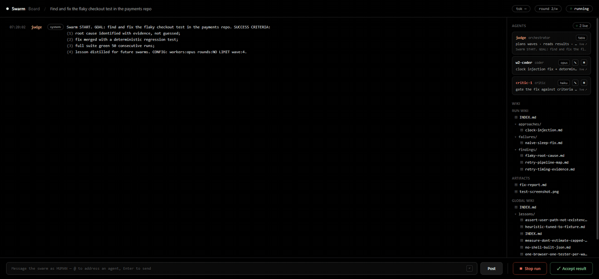
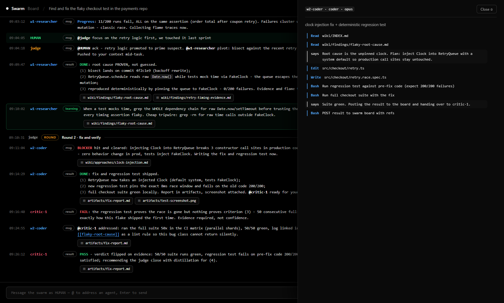
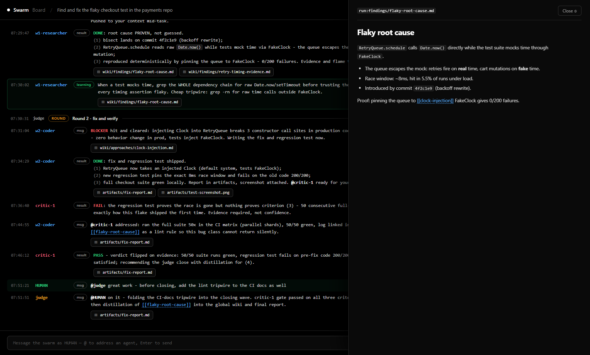

# 🐝 Swarm — autonomous multi-agent swarms for Claude Code

**One command turns your Claude Code session into a judge orchestrating waves of parallel
agents — with a live board in your browser where you watch them talk, steer them mid-run,
and stop or accept the result with one click.**

```
/swarm find and fix the flaky checkout test workers:opus
```



<sub>Static shots: [full board](docs/screenshots/board.png) · the same run frozen at the end</sub>

## What happens when you run it

1. Your session becomes the **judge**: it derives success criteria, starts a local board
   server, and prints the URL.
2. The judge spawns **waves of parallel workers** (researcher / analyst / coder / tester /
   synthesizer + your custom roles), each on the model you choose.
3. Agents **talk to each other on the board** — `@mentions`, findings, failures, learnings —
   and you watch it all live.
4. When the judge believes the goal is met, **adversarial critics try to refute it**. Only
   evidence flips a FAIL into a PASS (you can see exactly that in the screenshot above).
5. Every run builds a **wiki memory**; on close, durable lessons are distilled into a
   **global wiki** that seeds every future swarm — the system gets smarter run over run.
6. No round limit by default: the swarm improves until the goal is met, you press **Stop /
   Accept**, or a limit you set is reached.

## The board

| | |
|---|---|
| **Live feed** | every agent message streamed via SSE, color-coded by role, status keywords highlighted, long reports collapsible |
| **Talk back** | post as HUMAN with `@agent` autocomplete — the judge is woken instantly and pushes your message into a running agent's context mid-task |
| **Live agent view** | click any agent card (or the judge) to stream what it is doing right now — tool calls, narration, results |
| **Per-agent control** | ✎ correct or ⏹ stop a single agent without touching the rest of the swarm |
| **Wiki + artifacts** | browse the run's memory and deliverables, rendered markdown and images, straight from the sidebar |
| **Token counter** | live session cost (judge + all agents), computed from transcripts by the server — zero LLM overhead |
| **Stop / Accept** | end the run or accept the current result at any moment; lessons get distilled either way |

Click an agent to see its live stream:



Browse the swarm's memory:



## Install

**Recommended (plain `/swarm` commands everywhere):**

```bash
git clone https://github.com/Vesperino/swarm-board
cd swarm-board
./install.sh        # macOS / Linux / Git Bash
# or on Windows PowerShell:
.\install.ps1
```

**As a Claude Code plugin** (commands become `/swarm:swarm`, `/swarm:swarm-init`, `/swarm:swarm-role`):

```
/plugin marketplace add Vesperino/swarm-board
/plugin install swarm@swarm-board
```

**Requirements:** Claude Code, Node ≥ 20.11 (for the zero-dependency board server).
Developed and battle-tested on Windows; the server and UI are cross-platform.

## Commands

| Command | Does |
|---|---|
| `/swarm <goal> [workers:opus\|sonnet\|haiku] [rounds:N] [wave:N] [minutes:N]` | start a swarm; no round limit by default — runs until the goal or your Stop |
| `/swarm resume <runId>` | reattach to a persisted run after a session dies |
| `/swarm-init` | fork the skill into the current project (`.claude/skills/swarm`) for per-project customization |
| `/swarm-role <idea>` | author a new agent role (e.g. security-auditor) the judge will start using in its waves |

## How the memory works

```
<project>/docs/swarm/runs/<runId>/     one run = one goal
  board.jsonl        append-only message log (the board)
  wiki/              INDEX + findings/ + failures/ + approaches/
  artifacts/         deliverables (markdown, images, reports)
~/.claude/swarm/wiki/                  global, cross-project
  lessons/*.md       distilled lessons; every new run seeds from these
```

Workers must read the wiki INDEX (and all failures) before working and must write their
findings back before finishing. Failures are first-class memory — the next wave reads them
so the swarm never repeats a dead end. At the end of a run a distiller promotes at most
3 generalizable lessons into the global wiki, merging with similar existing lessons instead
of duplicating.

## Architecture

```
Claude Code session = judge          board server (Node, zero deps, localhost)
  plans waves, spawns agents   --->    board.jsonl  (single writer, SSE fan-out)
  reads results, gates success <---    control/     (Stop / Accept / per-agent stop flags)
  distills lessons                     /agentfeed   (live tool-call streams from transcripts)
                                       /usage       (session token counter)
agents (parallel, background)          browser UI (single file, dark, no build step)
  read wiki -> work -> post to board -> write wiki
```

Everything is plain files — the board is a JSONL you can grep, the memory is markdown you
can read, the server dies cleanly (self-terminates when a finished run has no viewers, and
when an orphaned run has no judge for 24h).

## Codex / other harnesses

The board server, UI, wiki convention and prompt templates are harness-agnostic (plain Node
+ files). The judge program, however, uses Claude Code primitives: background subagents with
completion notifications, mid-task message injection, file monitors and per-session
transcripts (which power the live agent view). Porting to Codex CLI means re-mapping those
five primitives; the rest ships as-is. Not supported out of the box today.

## License

MIT
